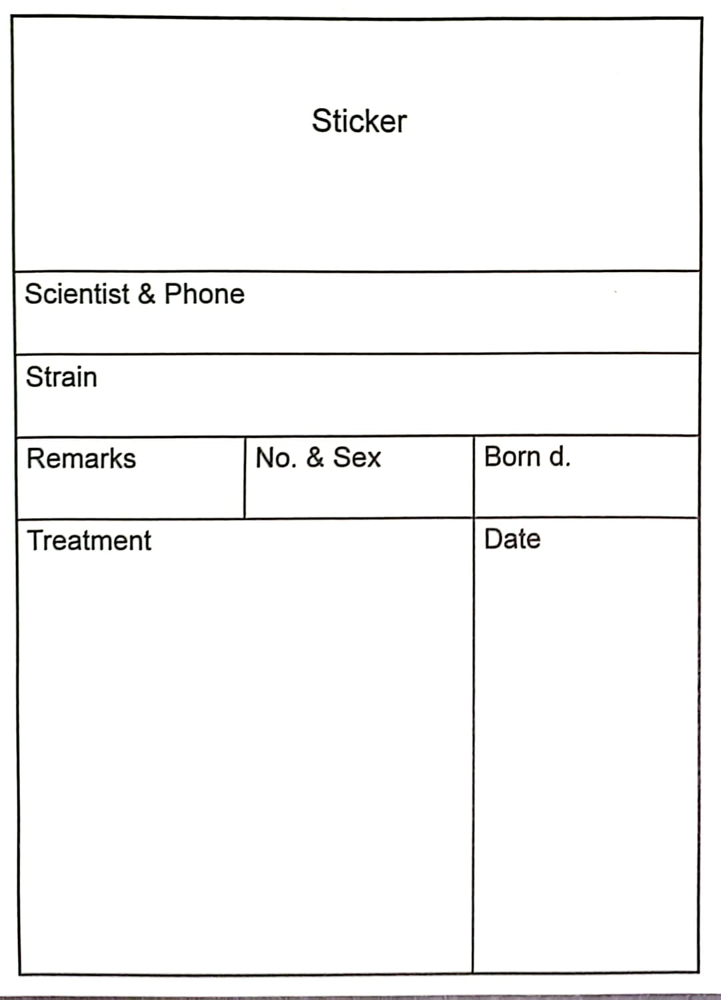

# SOP: Bird Monitoring and Tracking

## Introduction

This document aims to establish ground rules for monitoring and tracking the history and current state of birds. It covers procedures, whereabouts, health, reservations, the bird naming system, and interaction with animal facility workers. Any deviation from the standard procedures described in this document may result in harm to the birds, the experimenter's own research, or fellow lab members. Therefore, adhering to the ground rules is crucial.

## Naming System

Bird names are written in all capital letters. The name should begin with the letter "L," indicating the left leg where a ring should be placed. If there is no ring on the bird's left leg, use the right leg, and the first letter in the bird's name will be "R." If the bird has rings on both legs, its name will always start with the letter "L".

The following letter in the bird's name will indicate the ring color. Here are some examples:

- B: Blue
- BLK: Black
- LB: Light Blue
- BR: Brown
- R: Red
- W: White
- Y: Yellow
- G: Green
- GR: Gray
- O: Orange

The next character after the color letter will be the ring number. The number should be an integer (e.g., 1, 4444, 213). Do not start numbering with a zero. For example, use "3" instead of "03" if the ring has the number 03. A number should always appear in the bird's name. If the bird has rings with no number,the bird should be ringed with another ring that contains a number.

### Example Bird Names

- LG4: Left leg green ring number 4.
- LLB4444: Left leg light blue ring number 4444.
- RO293: Right leg orange ring number 293.
- LBRRR2: Left leg brown ring (no number) and right leg red ring number 2.
- LBLK4RG168: Left leg black ring 4 and right leg green ring 168.

## Monitoring and Tracking Bird History and Current State

Just as individuals have medical histories, birds in our care also possess medical records. In some cases, experiments require the use of the same bird over extended periods, ranging from weeks to months and even years. It is imperative that we meticulously track the history and current state of each bird. This not only constitutes good practice but also serves to minimize any potential harm to the bird, the experiments, or the risk of errors.

### Bird Management Platform

To facilitate this tracking, we utilize the [Bird Management Platform](https://prodis.weizmann.ac.il/pls/htmldb/f?p=468:101:11177740050203:::::). Please note that access to this platform is required to view the provided link.
Both students who are working with the birds, animal fascility workers and the vetrinerian in charge of the animal fascility should have access to this platform. 

Any updates regarding birds condition shuold be updated in this platform.

#### Platform Content

The Bird Management Platform encompasses comprehensive information about all the birds in our lab, including those presently in residence. Each bird's dedicated page includes the following details:

- **Bird's ID (Name)**
- **Sex and Type:** Canary or Zebra Finch
- **Arrival Date and Source**
- **Current Location**
- **Parents**
- **Hatch Date**
- **Age in Post-Hatch Days**
- **Reservation Status and Details**
- **Participation in IACUC**
- **Vital Status (Alive/Deceased) and Surgical History**
- **Additional Notes**
- **Files**
- **Pregnancy Information**
- **Transfers and Training Details**
- **Procedures (e.g., Medical Examinations, Virus Injections)**
- **Bird's Weight**

### Best Practices for Experimenters

Experimenters are required to consult the Bird Management Platform before undertaking any bird-related operation. Additionally, it is crucial to update the bird's page post-operation or any alteration in the bird's current state. This includes ensuring the bird's health, confirming it is not Reserved for someone else, and verifying that it is not engaged in other experiments.

This proactive approach ensures the overall well-being of the birds and maintains the accuracy of our records.

## Working with the Animal Facility

Animal facility workers are responsible for the well-being of the birds during their stay in the facility. They conduct routine check-ups, administer treatments, clean cages, and provide general care. Effective communication with both the animal facility workers and the veterinarian is crucial to ensure that any changes in the birds' status are known to all caregivers.

### Types of Bird Housings

There are two types of housing for the birds: regular cages and yards (located in Room 141 of the animal facility).

### Bird Cage Cards

Each cage is equipped with a card, as shown in the image below:

These cards, provided by the animal facility, display essential information about the birds in the cage. It is our responsibility to document any changes or treatments under the "Treatments" section on the card. For example, if a bird is taken to the lab, this should be recorded in that section.

### Tracking Table for Yards

In yards where multiple birds are housed, individual cards may not be as relevant. Instead, each cage in the yard will have a tracking table. You can find the template for this table in the [XLSX file linked here](link_to_xlsx_file.xlsx). Fill in this table to record relevant information for each cage in the yard.

## Summary
Effective tracking and monitoring of the birds' condition is crucial for conducting accurate research and reducing the risk of errors. This section outlines various methods for tracking and monitoring the birds' state and location. It is requierd that experimenters thoroughly review the birds' records before undertaking any operations and  after each operation or change in the birds' status, it is mandatory for experimenters to promptly update the birds' records. This ensures transparency and accuracy in managing the birds' information throughout the research process.