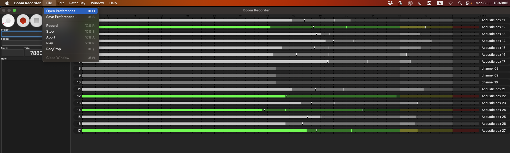
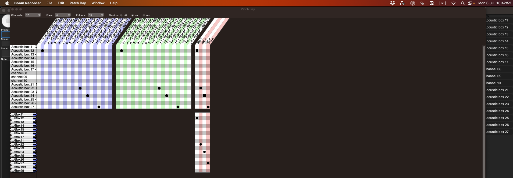
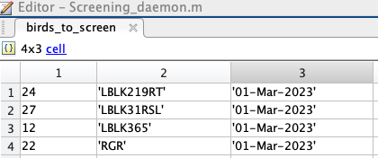

# Guide to Using BoomRecorder for Bird Song Recording

## Overview
In the lab, we record bird songs using a digital audio workstation (DAW) called **BoomRecorder**. This DAW integrates with hardware (see [Working with Focusrite](https://github.com/NeuralSyntaxLab/lab-handbook/blob/Ido_Lab-handbook/Sound%20recording/Working%20with%20Focusrite.md) for details). BoomRecorder is a user-friendly tool that supports the recording of multiple tracks—up to 256 tracks in the licensed version, which we use in the lab.

This guide covers:
- The main graphical user interface (GUI) of BoomRecorder.
- How to configure recording settings.
- Routing tracks to files and folders.

For further details, refer to the official [BoomRecorder Manual](https://github.com/user-attachments/files/18251557/BoomRecorderManual.pdf).

---

## Recording Panel
The **Recording Panel** is the primary screen in BoomRecorder. It displays user-allocated channels (refer to [Patch Bay](#patch-bay)) and their names. Key components include:
- **Record, Play/Stop, Abort Buttons**
- **Elapsed Time** and **Time Code**
- Buttons for additional features like the Patch Bay and Frequency Analyzer.

### Recording Panel Image

### Labeled Elements:
- **Yellow Arrow**: dB meter for allocated channels.
- **Red Arrow**: Names of allocated channels.
- **Orange Arrow**: 
  - **Top**: Elapsed recording time.
  - **Bottom**: Time code.
- **Green Arrow**: Record, Play, and Stop buttons.
- **Blue Arrow**: Patch Bay button.

---

## Patch Bay
The **Patch Bay** is the central interface for routing inputs to outputs and configuring file paths. In BoomRecorder:
- Inputs, outputs, and files are routed via a matrix.
- Files are saved in specific folders based on user-defined paths.

In the licensed version, up to 256 channels can be routed to 256 inputs and saved across a maximum of 16 folders. Our lab configuration ensures:
1. Each input (e.g., from an acoustic box) is routed to a unique channel.
2. Each channel’s data is saved in a corresponding file, organized into specific folders.

### Patch Bay Image

### Labeled Elements:
- **Orange Arrowhead**: Number of channels, files, and folders.
- **Input Matrix (Blue and White)**: Allocates inputs to channels.
- **Output Matrix (Green and White)**: Allocates outputs.
- **Channel-to-File Matrix (Red and White)**: Maps channels to files.
- **File-to-Path Matrix (Red and White)**: Maps files to save paths.
- **Green Rectangle**: Active channels.
- **Red Rectangle**: Folder paths in use.

---

## Saving and Loading a Simplified Configuration
You don't need to re-route the Patch Bay matrix by hand every session. BoomRecorder can save the full routing setup (channel/file/folder counts and all matrix connections) as a **Preferences** file, and reload it later from **File > Open Preferences...**.

This makes it easy to keep more than one configuration on hand — for example, a full setup that writes every acoustic box to its own folder, alongside a simplified one that only records the cages you actually need for a given experiment.

### Example: Recording Only the Cages You Need
Instead of routing all 16 acoustic boxes to 16 separate folders, you can reduce the **Files** count in the Patch Bay (top of the window) and connect only the channels you care about to those files. In the example below, 17 input channels are still available, but only 4 files are defined, and just the acoustic boxes actually being used (here, boxes 22–24) are routed into the Channel-to-File matrix:

Save this setup with **File > Save Preferences...** so it can be reloaded directly next time, instead of rebuilding the routing from scratch.

> **Note**: If you simplify the recording setup this way, remember to also update the screening daemon's `birds_to_screen` list (see [Screening Daemon Configuration](#screening-daemon-configuration)) so it only screens the boxes/birds that are actually being recorded.

---

## File Name Settings
Proper file naming is essential for the screening algorithm, which:
1. Detects files containing bird songs.
2. Segments recordings into individual songs.

### File Name Format:
- **Structure**: Room name, two-digit channel number, year, month, day, hour, minute, second.
- **Example Image**:

---

## Time Settings
Time synchronization between software and hardware is crucial. For details, refer to [Working with Focusrite](https://github.com/NeuralSyntaxLab/lab-handbook/blob/Ido_Lab-handbook/Sound%20recording/Working%20with%20Focusrite.md).

In **BoomRecorder**:
- Use **ADAT** as the clock source.
- Match the sample rate to that of the audio device.

### Time Settings Image

---

## Handling BoomRecorder Crashes
If BoomRecorder crashes with the error:
> "We lost samples between the audio interface and the i/o cycle"

Do the following:
- Ensure the **master** and **slave** clocks are synchronized. Refer to the section on configuring the Scarlett 18i20 as Master or Slave in [this guide](https://github.com/NeuralSyntaxLab/lab-handbook/blob/Ido_Lab-handbook/Sound%20recording/Working%20with%20Focusrite.md).

---

## Screening Daemon Configuration
Recordings produced by BoomRecorder are picked up by a separate MATLAB screening pipeline (`Screening_daemon.m`), which detects bird songs in the recorded files and segments them into individual songs. The daemon only screens the boxes listed in its `birds_to_screen` variable — a cell array where each row specifies a box/channel number, the bird's ID, and the date screening should start from:

If you change which cages are being recorded (see [Saving and Loading a Simplified Configuration](#saving-and-loading-a-simplified-configuration)), update `birds_to_screen` to match — otherwise the daemon will keep looking for files from boxes that are no longer being recorded, or miss boxes that were added.
